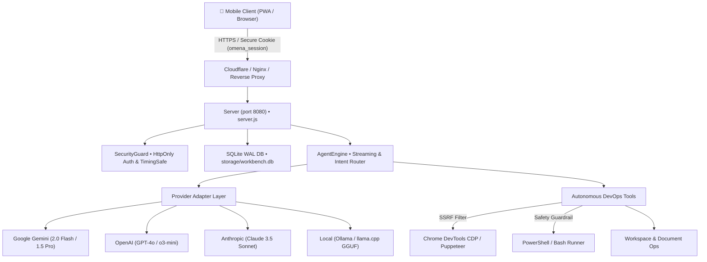

# OMENA Mobile Agent Workbench & Agentic IDE v2.0
> **Production-Grade Open-Source Autonomous AI Agent Workbench & Agentic IDE**  
> Minimalist `llama.cpp`-style mobile web UI backed by an enterprise-hardened Node.js engine, multi-provider adapters, SQLite persistence, and SSRF guardrails.

[](LICENSE)
[](Dockerfile)
[](https://nodejs.org)
[](https://sqlite.org)

---

## 🌟 Architecture & Capabilities



### 1. Enterprise Security Architecture
- **HttpOnly Session Cookies:** Deprecates raw tokens and `localStorage` credential exposure. Authenticates with constant-time password matching (`crypto.timingSafeEqual`) and issues an `HttpOnly`, `SameSite=Lax`, secure session cookie.
- **SSRF Protection on Browser Automation:** Rejects access to loopback (`127.0.0.1`, `localhost`), link-local metadata (`169.254.169.254`), and private subnets (`10.0.0.0/8`, `172.16.0.0/12`, `192.168.0.0/16`). Only public HTTP/HTTPS URLs may be requested.
- **Command Safety Guardrails:** Restricts shell execution strictly to the workspace directory. Automatically intercepts and blocks dangerous commands (e.g. `rm -rf /`, formatting drives, touching system roots).

### 2. Multi-Provider Capability Adapters
Every model provider implements an explicit capabilities schema:
| Model ID | Provider | Streaming | Tools | Vision | Reasoning |
| :--- | :--- | :---: | :---: | :---: | :---: |
| `gemini-2.0-flash` | Google Gemini | ✅ | ✅ | ✅ | ✅ |
| `gemini-1.5-pro` | Google Gemini | ✅ | ✅ | ✅ | ✅ |
| `gpt-4o` | OpenAI ChatGPT | ✅ | ✅ | ✅ | ✅ |
| `o3-mini` | OpenAI ChatGPT | ✅ | ✅ | ✅ | ✅ |
| `claude-3-5-sonnet` | Anthropic Claude | ✅ | ✅ | ✅ | ❌ |
| `local-gguf` | Ollama / llama.cpp | ✅ | ❌ | ❌ | ❌ |

Model switching is instantly accessible via the top navigation pill without forcing a page reload.

### 3. Clean UX & Safe Event Protocol
- **Minimalist UI Preservation:** Faithfully replicates the `llama.cpp` server UI aesthetic with clean edge-to-edge typography, dual themes (Clean White Safari & OLED True Black), auto-expanding textarea, attachment paperclip `📎`, Web Speech voice dictation `🎙️`, and circular send button `↑`.
- **Dynamic Viewport (`dvh`):** Mobile virtual keyboards are compensated using `window.visualViewport` listeners to prevent interface clipping.
- **Structured SSE Protocol:** Streams events cleanly without dumping raw JSON errors or internal chain-of-thought:
  - `text_chunk`: streaming assistant tokens.
  - `tool_start`: minimal inline pill (`⚙️ Shell: git status`).
  - `tool_log`: real-time log chunk updates inside collapsible accordion.
  - `tool_done`: status pill with duration and exit code (`✓ 180ms` / `⛔ Blocked`).
  - `browser_frame`: responsive screenshot card preview in the slide-up drawer.
  - `done`: finalized turn marker.

### 4. Database & Operational Endpoints
- **Persistence:** Built-in zero-dependency SQLite WAL database (`storage/workbench.db`) storing authentication sessions, conversation history, tool logs, and settings.
- **Endpoints:**
  - `GET /health`: JSON status of server, uptime, memory, and database connectivity.
  - `GET /ready`: readiness state of DB and browser automation engine.
  - `GET /api/models`: list of supported models and capability flags.
  - `POST /api/auth/login`: verifies password and sets `HttpOnly` cookie.
  - `POST /api/auth/logout`: clears session cookie.
  - `GET /api/auth/me`: reports current session validity.
  - `GET /api/sessions`: returns saved conversation threads.
  - `POST /api/stream`: SSE streaming chat and tool execution.

---

## 🚀 1-Click Deployment Guide

### Option A: Docker Compose (Recommended for Any VPS)

1. **Clone and enter repository:**
   ```bash
   git clone https://github.com/YOUR_ORG/omena-mobile-agent-workbench.git
   cd omena-mobile-agent-workbench
   ```

2. **Set your admin password:**
   ```bash
   export ADMIN_PASSWORD="your-strong-password"
   ```

3. **Start container in background:**
   ```bash
   docker compose up -d
   ```

4. **Verify running state:**
   ```bash
   curl -f http://localhost:8080/health
   # Returns: {"status":"ok","uptime":...,"db":"connected",...}
   ```

---

### Option B: Native Node.js (v22+)

1. **Install dependencies:**
   ```bash
   npm install --omit=dev
   ```

2. **Start the server:**
   ```bash
   ADMIN_PASSWORD="your-strong-password" npm start
   ```

3. **Run automated verification tests:**
   ```bash
   npm test
   # Runs test_endpoints.js (health, auth, SSRF, guardrails, SSE streaming)
   ```

---

## ⚙️ Environment Variables

| Variable | Default | Description |
| :--- | :--- | :--- |
| `ADMIN_PASSWORD` | `omena2026` | Password required to unlock the workbench and generate HttpOnly session cookies |
| `PORT` | `8080` | HTTP port the server listens on |
| `HOST` | `0.0.0.0` | Bind address (`0.0.0.0` for containers, `127.0.0.1` for local only) |
| `DATABASE_PATH` | `storage/workbench.db` | Location of the persistent SQLite WAL database |
| `WORKSPACE_ROOT` | `../../` | Root directory for file inspection and safe shell execution |
| `LOCAL_AI_URL` | `http://host.docker.internal:11434/v1` | Base URL for local Ollama / llama.cpp inference |
| `PUPPETEER_EXECUTABLE_PATH` | auto-detected | Path to Chromium / Google Chrome binary |

---

## 🧪 Verification & Acceptance Testing

Run the included verification suite:
```bash
node test_endpoints.js
```

Test Results Matrix:
```
======================================================
🚀 OMENA Verification Suite: http://localhost:8080
======================================================

  ✅ [PASS] GET /health returns 200 and DB connected
  ✅ [PASS] GET /ready returns 200
  ✅ [PASS] GET /api/models returns capability flags
  ✅ [PASS] Unauthenticated GET /api/sessions returns 401 Unauthorized
  ✅ [PASS] Unauthenticated POST /api/stream returns 401 Unauthorized
  ✅ [PASS] POST /api/auth/login with invalid password returns 401
  ✅ [PASS] POST /api/auth/login returns 200 and sets HttpOnly cookie
  ✅ [PASS] GET /api/auth/me with session cookie returns authenticated: true
  ✅ [PASS] GET /api/sessions with cookie returns persistent sessions from SQLite
  ✅ [PASS] POST /api/stream executes shell command with real-time SSE events
  ✅ [PASS] Security Guardrail blocks dangerous command (rm -rf /)
  ✅ [PASS] SSRF Guardrail blocks internal loopback URL navigation

======================================================
📊 Test Summary: 12 passed, 0 failed
======================================================
```

---

## 📜 License
MIT License. Created by OMENA Autonomous Systems.
